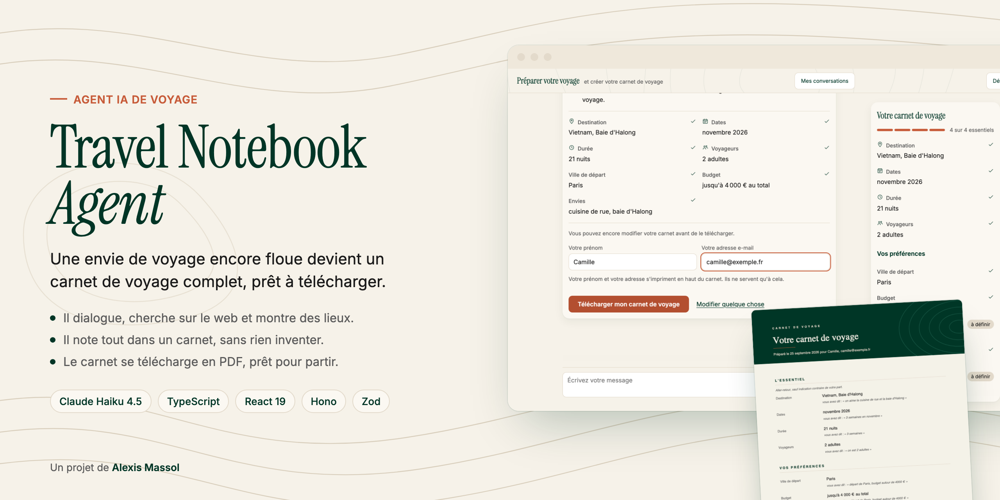
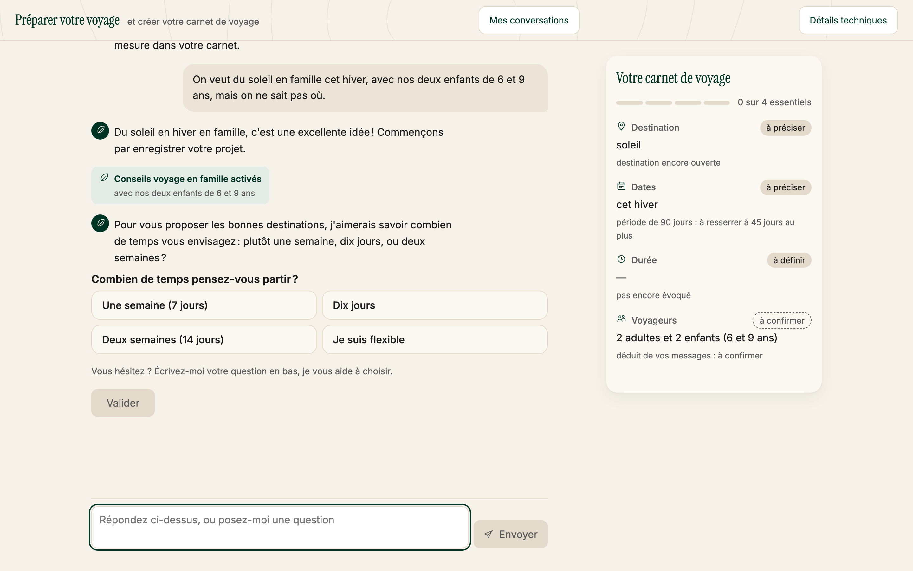
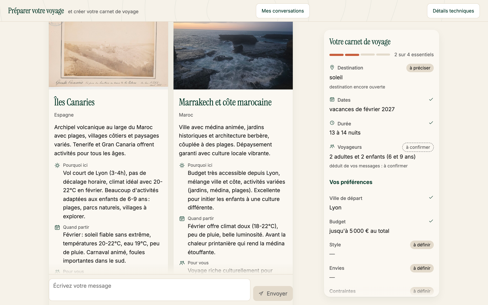
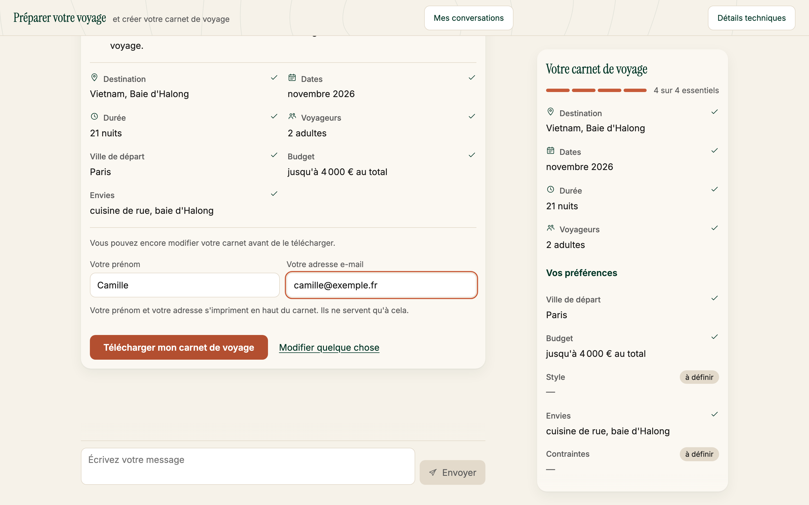
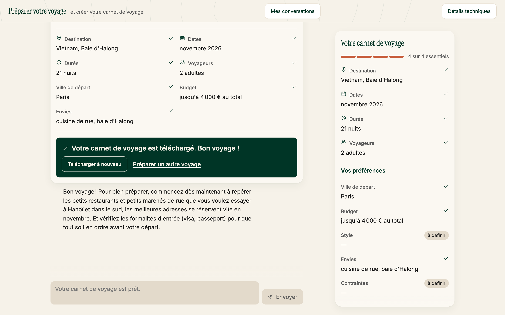
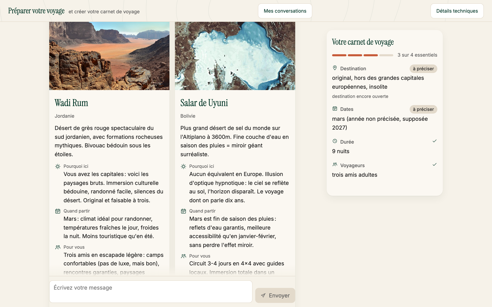
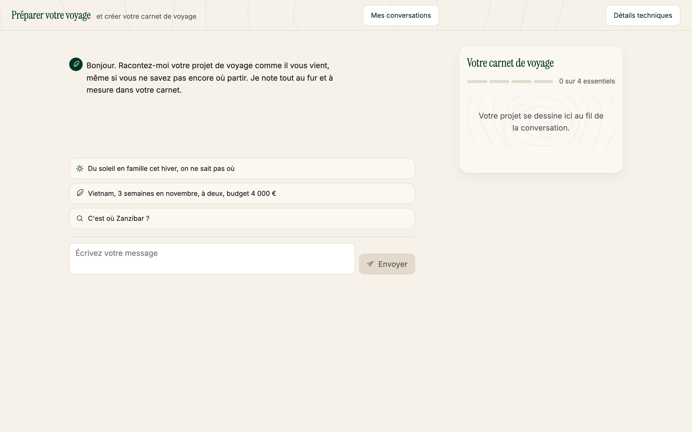
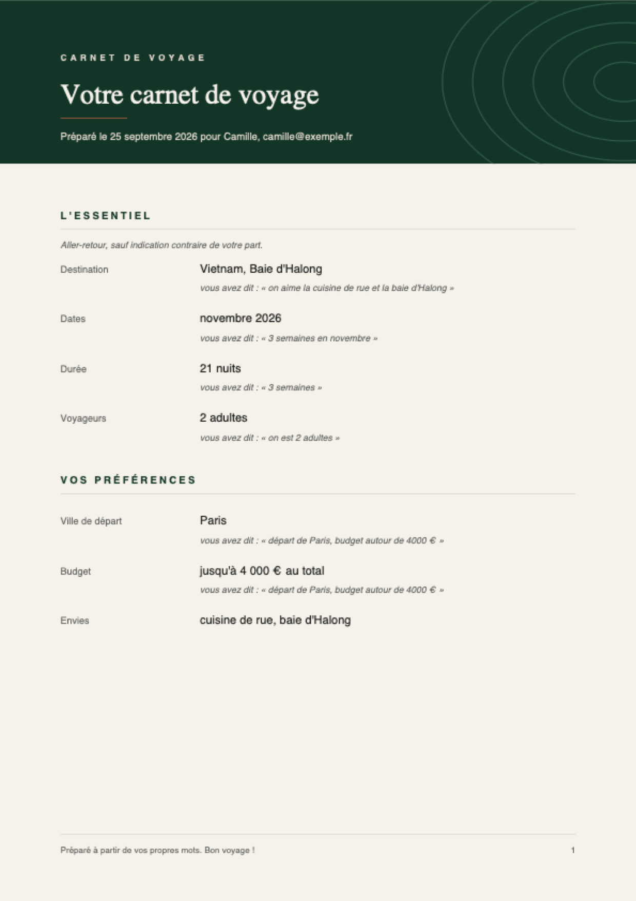
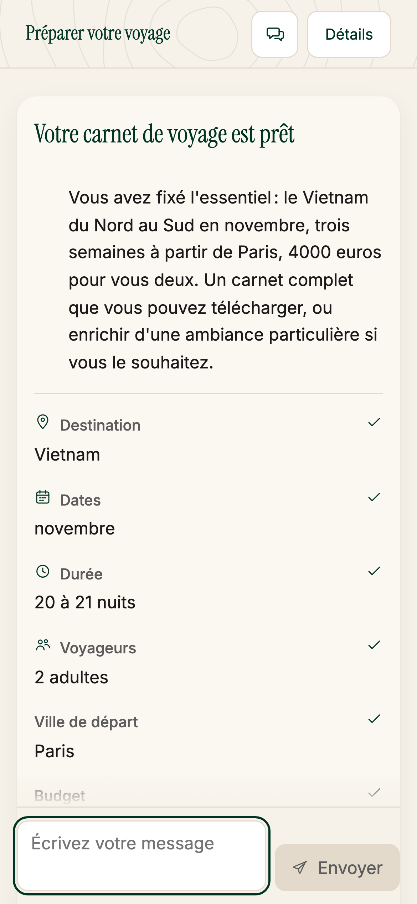
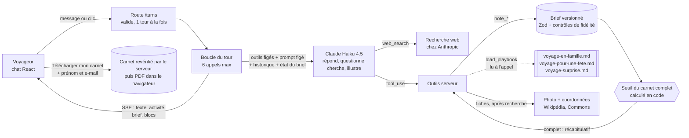

# Travel Notebook Agent



Un agent IA qui aide un voyageur indécis à trouver sa destination et à préparer son voyage. Le
voyageur écrit son envie comme à un ami. L'agent pose des questions, cherche sur le web et montre
des fiches destination. Au fil de la conversation, il remplit un **carnet de voyage**, que le
voyageur télécharge en PDF à la fin.


**Par où commencer.** Ce fichier donne l'essentiel en dix minutes. Ensuite :
1. [`docs/choix-techniques.md`](docs/choix-techniques.md) : chaque décision, pourquoi, et ce
   qu'elle coûte ;
2. [`docs/architecture.md`](docs/architecture.md) : le schéma système et le trajet d'un message ;
3. [`docs/glossaire.md`](docs/glossaire.md) : les mots techniques expliqués simplement.

---

## Sommaire

1. [Aperçu](#aperçu)
2. [Démarrer](#démarrer)
3. [Essayer en cinq minutes](#essayer-en-cinq-minutes)
4. [Ce que le voyageur peut faire](#ce-que-le-voyageur-peut-faire)
5. [Le schéma système](#le-schéma-système)
6. [Les choix d'architecture](#les-choix-darchitecture)
7. [Le carnet et les informations floues](#le-carnet-et-les-informations-floues)
8. [Les instructions chargées à la demande](#les-instructions-chargées-à-la-demande)
9. [Choix produit](#choix-produit)
10. [Observabilité](#observabilité)
11. [Évaluation](#évaluation)
12. [Ce qui a été mesuré](#ce-qui-a-été-mesuré)
13. [Process de réalisation](#process-de-réalisation)
14. [Prochaines étapes](#prochaines-étapes)
15. [Structure du dépôt](#structure-du-dépôt)
16. [Contact](#contact)

---

## Aperçu

Captures prises sur l'application réelle, avec le vrai modèle. Aucune réponse n'est retouchée.

| Une envie floue, notée sans rien inventer | Des lieux proposés après une recherche web |
|---|---|
|  |  |
| **Le carnet est complet : il reste à le télécharger** | **Le carnet est téléchargé** |
|  |  |
| **Le mode surprise : des idées rares, vérifiées par une recherche** | **L'accueil et ses trois départs** |
|  |  |

| Le carnet PDF que le voyageur emporte | Sur téléphone |
|---|---|
|  |  |

Chaque ligne du carnet porte sa phrase d'origine : « vous avez dit : … ». Dans l'interface,
« à préciser » veut dire flou et « à confirmer » veut dire déduit. Rien d'incertain ne s'affiche
comme sûr.

## Démarrer

Prérequis : Node 20.19 ou plus, et une clé API Anthropic. La clé se crée sur
[console.anthropic.com](https://console.anthropic.com/). Une conversation coûte quelques centimes.

```bash
git clone https://github.com/alexismassol/travel-notebook-agent.git
cd travel-notebook-agent
npm install
cp .env.example .env      # renseigner ANTHROPIC_API_KEY
npm run dev               # interface http://localhost:5173, API :8787
```

Ouvrir http://localhost:5173 et écrire son envie de voyage, comme à un ami.

| Commande | Rôle | Coût API |
|---|---|---|
| `npm run dev` | API et interface, rechargement à chaud | à l'usage |
| `npm start` | Compile l'interface et sert tout sur :8787 | à l'usage |
| `npm run check` | Biome, vérification des types, contrôle des docs, tests unitaires | aucun |
| `npm run test:integration` | Agent réel : playbook famille, carnet complet, recherche web, question à choix | quelques centimes |
| `npm run scenarios` (`SCENARIO_REPEAT=3` recommandé) | Rejoue les 16 scénarios de référence sur le vrai modèle et écrit les taux dans `docs/scenarios/` | mesuré : 1,29 $ pour 48 passages |
| `npm run visual-check` | Conversation réelle dans le navigateur, téléchargement du carnet, captures desktop et mobile | quelques centimes |

Le modèle se change sans toucher au code : `ANTHROPIC_MODEL=claude-sonnet-5 npm run dev`.

`npm run visual-check` pilote un vrai navigateur. Si Chromium n'est pas déjà installé sur la
machine, `npx playwright install chromium` le télécharge une fois pour toutes.

**Rien n'est simulé côté agent.** L'application, les scénarios et les tests d'intégration appellent
le vrai modèle et la vraie recherche web. Les scénarios écrivent seulement à l'avance ce que tape
le voyageur. Seuls les tests unitaires de la boucle utilisent un faux client, pour vérifier la
mécanique, et la doc ne s'en sert jamais comme preuve du comportement de l'agent.

## Essayer en cinq minutes

L'écran d'accueil propose trois départs. Voici des intentions de référence, et ce qu'il faut
regarder :

| Écrire | Ce que l'agent doit faire | Où le voir |
|---|---|---|
| « Du soleil en famille, on ne sait pas où » | Charger les conseils famille, demander l'âge des enfants | Bandeau « Conseils voyage en famille activés », puis des fiches |
| « Vietnam, 3 semaines en novembre, à deux » | Valider ce qu'il a compris, puis présenter le carnet | Carnet rempli 4/4 et bouton « Télécharger mon carnet de voyage » |
| « Le trek au Népal en juillet, c'est jouable ? » | Chercher avant d'affirmer, alerter sur la mousson | Ligne « Recherche : ... » puis sources |
| « C'est où Zanzibar ? » | Montrer une fiche destination | Fiche avec photo et carte dépliable |
| « Bali en juin, on sera 4 ou 6 » | Demander le nombre exact avec une question à choix | Cartes cliquables sous le message |
| « Surprenez-moi, dix jours en mars » | Charger le mode surprise et montrer des idées rares après une recherche | Bandeau « Conseils voyage surprise activés », puis des fiches |

Ces comportements sont mesurés en taux, pas en acquis. Mesure du 2026-09-25, campagne définitive de
16 scénarios, 3 passages chacun. Fiches famille 3 sur 3, carnet Vietnam validé 3 sur 3, recherche
avant d'affirmer sur le Népal 3 sur 3, fiche Zanzibar 3 sur 3. Question à choix sur Bali 1 sur 3 :
le modèle varie, 2 sur 3 et 3 sur 3 dans des campagnes précédentes. Mode surprise, fiches 2 sur 3
et recherche 3 sur 3 ([`docs/scenarios/README.md`](docs/scenarios/README.md)).

Le carnet à droite (bandeau repliable sur mobile) se remplit à chaque message. Une information
floue s'affiche « à préciser », une déduction « à confirmer », une contradiction « à trancher » :
jamais comme une valeur sûre.

## Ce que le voyageur peut faire

**Poser des questions plutôt que répondre.** « Tu me proposes quoi ? », « c'est où ? », « faut-il
un visa ? ». L'agent cherche sur le web avant d'affirmer une saison ou une formalité, et montre
ses sources. Le but n'est pas de remplir un formulaire déguisé, c'est de l'aider à décider.

**Écrire pendant que l'agent répond.** Le champ reste ouvert. À la place d'« Envoyer », un bouton
carré « Arrêter » coupe la réponse en cours ; le carnet ne garde alors rien de partiel.

**Reprendre une conversation.** Actualiser la page ne perd rien. Le navigateur garde le fil, le
serveur garde l'historique du modèle, et la page demande au serveur s'il l'a encore avant de
laisser continuer. Le bouton « Mes conversations » du bandeau liste les cinq dernières, avec leur
titre, leur date et leur état.

Le titre vient du carnet : « Martinique, fin octobre », « Japon ou Corée du Sud, 2 adultes ».
Aucun appel au modèle n'est fait pour titrer, l'information est déjà structurée.

**Télécharger son carnet.** Quand le carnet est complet, le voyageur donne son prénom et son
adresse e-mail, imprimés en tête du carnet, puis clique sur « Télécharger mon carnet de voyage ».
Le serveur revérifie que le carnet est complet, puis le PDF se télécharge tout seul. Chaque
information y porte son degré de certitude et la phrase d'origine.

**Un panneau qui ne s'adresse pas à lui.** « Détails techniques » est un outil de démonstration
et de revue, pas une fonctionnalité voyageur. En production il serait derrière un réglage
interne. Ce qu'il contient est décrit dans [Observabilité](#observabilité).

**Deux limites, dites clairement.** Le serveur oublie une conversation inactive depuis six heures,
et un redémarrage la perd aussi : le fil reste alors lisible, mais un bandeau dit qu'on ne peut
plus la continuer. Et le stockage est propre à ce navigateur, rien ne suit d'un appareil à
l'autre.

## Le schéma système

Qui décide quoi, à chaque tour. Le détail et le trajet complet d'un message sont dans
[`docs/architecture.md`](docs/architecture.md).



| Le modèle décide | Le code décide |
|---|---|
| Répondre, questionner (texte ou choix), chercher, illustrer | Si une entrée d'outil est valide (Zod, syntaxe, JSON lisible) |
| Quand charger les instructions famille ou fête | Si le carnet est complet (seuil calculé) |
| Ce qu'un message veut dire, et avec quel statut | Si un nombre de voyageurs « confirmé » a vraiment été dit |
| Le texte des fiches | La photo et les coordonnées des fiches |
| | Sous quelle case une phrase du voyageur est citée |

## Les choix d'architecture

Le registre complet, avec les options écartées, le coût de chaque choix et qui l'a tranché :
[`docs/choix-techniques.md`](docs/choix-techniques.md).

| Choix | Pourquoi | Ce qu'il coûte |
|---|---|---|
| **TypeScript partout, Node et Hono, React et Vite** (décision 0) | Un seul langage : le serveur et l'interface partagent leurs contrats, vérifiés par le compilateur | Une étape de compilation |
| **Boucle écrite à la main sur l'API Messages** (décision 1) | On construit la requête, donc un test peut prouver ce que voit le modèle | 493 lignes à maintenir |
| **Un seul agent avec 9 outils**, règles tenues en code (décision 2) | Pas de formulaire déguisé ; les enchaînements imprévus passent | La qualité des choix se mesure par scénarios |
| **Brief en cases** : valeur + statut + citation (décision 3) | Le flou et la contradiction deviennent des états, pas des trous | Le modèle peut se tromper de statut |
| **Seuil du carnet complet calculé en code** (décision 4) | Décision produit stable, testable, réglable sans toucher au prompt | Seuils à valider avec des voyageurs |
| **Claude Haiku 4.5** (décision 6) | Coût à plusieurs milliers de conversations par mois | Plus de garde-fous nécessaires, tous mesurés |
| **Outils de notes simples en mode strict** (décision 7) | Haiku abîmait les objets imbriqués | 5 outils au lieu d'un |
| **Rappels courts à chaque tour, question suivante après l'enregistrement** (décision 9) | Haiku oubliait les règles écrites une seule fois | Des tokens répétés à chaque tour |
| **Contrôles de fidélité en code** (décisions 17 à 19, et 40) | Risque clé : un carnet faux mais sûr en apparence | Parfois une question de plus, une citation perdue |

Ce qui a été écarté, et pourquoi :
- **Claude Agent SDK** : c'est la boucle de Claude Code, avec des outils fichiers et terminal à
  neutraliser, et un contexte plus dur à prouver ;
- **routeur d'intentions** : deux appels par tour, et les intentions imprévues sont mal classées ;
- **Kubernetes, bases de données** : rien à démontrer avec ;
- **LiteLLM Gateway** : utile à grande échelle, pas pour un seul fournisseur ;
- **Langfuse branché** : l'observabilité est un design écrit ;
- **CopilotKit** : une abstraction de plus sur la partie qui compte ici, l'interaction.

## Le carnet et les informations floues

Détail : [`docs/spec-technique.md`](docs/spec-technique.md). Code : `src/shared/brief.ts`.

Derrière le carnet, il y a un **brief** : la structure que l'agent remplit. Il a deux groupes :
`mandatory` (destination, dates, durée, voyageurs) et `useful` (ville de départ, budget, style,
envies, contraintes). S'y ajoutent `nuances`, les phrases du voyageur utiles à son voyage. Chaque
information est une **case** avec un statut :

| Statut | Sens | Exemple | Affiché |
|---|---|---|---|
| `vague` | Le voyageur est flou ou flexible : on garde un intervalle | « cet été » -> 1er juin au 31 août | à préciser |
| `inferred` | L'agent déduit, le voyageur n'a pas dit | « avec les petits » -> au moins un enfant | à confirmer |
| `confirmed` | Dit clairement ou validé | « on est 2 » | coché |
| `conflicting` | Deux réponses : les deux sont gardées | « 3 semaines » puis « 10 jours » | à trancher |
| `unknown` | Pas encore évoqué | | à définir |

Chaque mise à jour garde la citation et le tour, et augmente la version. **Le carnet est complet
quand** :
- la destination tient dans un seul pays ou une seule région ;
- la fenêtre de dates fait 45 jours au plus ;
- la durée est connue à 7 nuits près et tient dans les dates ;
- les voyageurs sont connus à une personne près, avec l'âge de chaque enfant ;
- rien n'est « à confirmer » ni « à trancher » (`completeness.ts`, 15 tests).

Quatre contrôles en code protègent ce carnet. Un nombre de voyageurs « confirmé » que le voyageur
n'a pas dit repasse « à confirmer » (décision 17). Une année non dite ne peut pas tomber dans le
passé (décision 18). Une phrase du voyageur n'est citée que sous les cases dont elle parle
(décision 40). Et un carnet déjà validé ne se représente jamais (décision 41).

## Les instructions chargées à la demande

Détail : [`docs/choix-techniques.md`](docs/choix-techniques.md), décisions 5, 38 et 42.

- Trois jeux d'instructions : `voyage-en-famille.md`, `voyage-pour-une-fete.md` et
  `voyage-surprise.md`, dans `src/server/agent/playbooks/`. Ils sont **lus sur le disque seulement
  quand l'agent appelle `load_playbook(name, reason)`**.
- Dans le contexte permanent, il n'y a que la description de l'outil, qui dit quand l'appeler.
- **Trace** de chaque chargement : tour, raison donnée par le modèle, origine `spontaneous` ou
  `nudged`. Elle est visible dans l'interface (« Détails techniques ») et dans `data/traces/`.
- **Filet** : si le brief contient des enfants, ou si le voyage est posé sur une fête, et que rien
  n'est chargé, le résultat de l'outil de notes rappelle de charger. C'est toujours l'agent qui
  charge ; le taux de `nudged` est une mesure.
- **Preuves** : `context.test.ts` vérifie qu'aucune ligne du playbook n'est dans la requête du
  tour 1 ni dans le prompt système, et qu'elles y sont après chargement. Sabotage vérifié : une
  ligne injectée fait échouer le test. Un test d'intégration réel montre Haiku qui charge seul.

## Choix produit

Texte complet : [`docs/produit.md`](docs/produit.md). Les ordres de grandeur sont des
hypothèses, pas des mesures.

L'agent cherche **le carnet le plus court qui permet d'organiser le voyage sans rien avoir à
redemander**. Chaque question coûte des voyageurs (environ 80 % d'abandon sur un long formulaire).
Chaque question en moins donne un carnet inutilisable (environ 30 % de projets trop flous). L'agent
ne repose jamais une question dont la réponse est dite ou se déduit : il déduit, affiche « à
confirmer », et fait valider ensuite. Seules les quatre informations obligatoires bloquent ; un
voyageur décidé télécharge son carnet dès le premier message.

**Le risque clé en production : un carnet faux qui a l'air sûr.** Une valeur plausible, bien formée,
marquée confirmée, que le voyageur n'a jamais dite. Ou une phrase citée sous une ligne dont elle ne
parle pas. Le nombre de voyageurs et les citations sont contrôlés en code (décisions 17 et 40) ;
la date et la destination ne le sont pas encore. Avant la production : mesurer la fidélité du
carnet et le faire relire par les voyageurs qui l'ont produit.

## Observabilité

Design écrit : [`docs/observabilite.md`](docs/observabilite.md). Ce qu'on mesure, et pourquoi :

- **Fidélité** : valeurs confirmées sans citation qui les justifie, déductions non confirmées à
  la validation, voyageurs ramenés « à confirmer » par le code.
- **Contrainte famille** : part des chargements `nudged` contre `spontaneous`, tour du chargement.
- **Ancrage** : affirmations de saison ou de formalité sans recherche dans le tour.
- **Tension produit** : part des conversations qui atteignent un carnet complet, tours jusqu'au
  carnet, abandon par tour, carnets téléchargés qui servent vraiment à réserver.
- **Fiabilité des outils** : erreurs de validation, syntaxe fuitée bloquée, JSON illisible récupéré.
- **Ton** : superlatifs, narration des coulisses, mot « brief », réponses trop longues, comptés en
  code à chaque réponse.
- **Coût par carnet complet** (pas par requête), recherches par conversation, **latence** au
  premier mot et par tour.

**Ce qui est déjà visible à l'écran.** Le panneau « Détails techniques » montre, à chaque tour, le
modèle, le nombre d'appels, les jetons, le temps jusqu'au premier mot et la durée. Puis le coût du
tour et de la conversation, la part de l'entrée relue depuis le cache et ce que ce cache évite de
payer, calculés dans `src/shared/pricing.ts`.

Sur une conversation réelle de dix tours : 615 474 jetons d'entrée, dont 537 189 relus depuis le
cache, soit 87 %. Coût réel 0,205 $, contre 0,669 $ pour le même trafic sans cache. Le taux de
cache sert aussi d'alarme : un prompt système qui bouge d'un octet le fait tomber d'un coup.

Ce panneau est un outil de démonstration et de revue. En production, il serait derrière un réglage
interne, et ces chiffres partiraient dans la même sonde que le reste, pas dans l'interface du
voyageur.

## Évaluation

Design écrit : [`docs/evaluation.md`](docs/evaluation.md). Priorités, dans l'ordre du risque :

1. **Fidélité du carnet** : aucune valeur inventée présentée comme confirmée, statuts justes,
   citations qui parlent de leur ligne.
2. **Contrainte famille** : chargement au bon tour.
3. **Ancrage factuel** : recherche avant une saison, une formalité, un conseil de santé.
4. **Efficacité du dialogue** : pas de question redondante, carnet complet sans reposer de question.
5. **Coût et latence** par conversation.

La méthode :
- rejouer les scénarios N fois et suivre des taux, jamais un succès isolé ;
- noter en code tout ce qui est déterministe : outils appelés, état du brief, seuil, ton ;
- pour le reste, un juge LLM avec une grille explicite, calibré sur un échantillon relu par des
  humains ;
- comparer Haiku 4.5 et Sonnet 5 avant tout changement de modèle.

Existe déjà : 416 tests unitaires et 5 tests d'intégration réels. Les 16 scénarios de
référence ont été rejoués 3 fois chacun, puis relus du point de vue du voyageur
([`docs/scenarios/relecture.md`](docs/scenarios/relecture.md)). S'y ajoute un essai de robustesse
sur 12 intentions jamais vues ([`docs/scenarios/robustesse.md`](docs/scenarios/robustesse.md)).

## Ce qui a été mesuré

Mesure du 2026-09-25, sur le vrai modèle : 16 scénarios de référence rejoués 3 fois, soit 48
conversations ([`docs/scenarios/README.md`](docs/scenarios/README.md)). Chaque ligne se relit dans
la transcription du scénario.

| Mesure, sur 48 passages | Résultat | Lecture |
|---|---|---|
| Tutoiement | 0 | Le vouvoiement ne dépend pas de la bonne volonté du modèle |
| Mot « brief » dit au voyageur | 0 | Remplacé par « projet » dans le texte affiché |
| Question à choix posée | 19 | Un passage sur deux : la conversation reste une conversation |
| Recherche web lancée | 23 | Une question de saison, de climat ou de fête la déclenche |
| Fiches destination affichées | 15 | Surtout quand la destination est ouverte ou que le voyageur interroge l'agent |
| Carnet validé | 6 | Les deux scénarios où le voyageur sait déjà, 3 fois sur 3 chacun |
| Réponse de plus de 80 mots | 9 | Un défaut de ton fréquent, avec le superlatif |
| Coût de la campagne | 1,29 $ | 30 recherches web facturées en plus |

Ce que la vérification réelle a trouvé et que les tests ne voyaient pas : un carnet PDF citait
« départ de Paris, budget autour de 4000 € » sous la ligne des envies. Une seule phrase servait à
plusieurs cases. Corrigé, avec un test qui tombe si on retire le correctif (décision 40).

**Latence et coût, sur 611 tours réels** relus dans les traces de `data/traces/`, tests exclus :

| Mesure | Médiane | 9 tours sur 10 | Pire cas |
|---|---|---|---|
| Premier mot affiché | 1,3 s | sous 6,3 s | 29,0 s |
| Tour complet | 8,2 s | sous 22,4 s | 98,9 s |
| Coût d'un tour | 0,017 $ | sous 0,040 $ | 0,089 $ |

36 % des tours dépassent dix secondes, et 173 de ces 220 tours lancent une recherche web. La
recherche est donc le premier facteur de latence, loin devant le reste. Le voyageur ne l'attend
pas les bras ballants : le premier mot arrive en 1,3 seconde, et la ligne d'activité dit ce qui
se passe. Le pire cas de 98,9 s est un tour à trois appels avec réécriture complète du cache.

Le cache sert 76,7 % de l'entrée sur ces 611 tours. Deux appels au modèle par tour en médiane,
20 % des tours en font trois ou plus.

**Ce qui reste mal tenu, mesuré** : un superlatif (« parfait », « excellent ») dans 27 passages
sur 48, une narration des coulisses (« je vais enregistrer ») dans 19, une réponse de plus de 80
mots dans 9. C'est la limite d'un rappel de ton écrit dans le prompt : le modèle le suit à moitié.

**Le voyageur qui interroge l'agent** (scénario 8) : il ne répond jamais directement, il demande.
L'agent cherche, compare le Sri Lanka et la Thaïlande avec des températures, répond sur le décalage
horaire, et note quand même durée, voyageurs et ville de départ. Le carnet finit à 3 obligatoires
sur 4 : il reste à choisir entre les deux pays.

**Le modèle n'est pas déterministe.** Deux mesures complètes du même agent donnent des taux qui
bougent d'un passage sur trois. C'est pour ça que la documentation cite des taux, jamais un essai
isolé.

Tests : 416 unitaires (`npx vitest run`), dont chaque correctif montré rouge puis vert, avec un
sabotage qui refait tomber le test ; 5 tests d'intégration réels
([`tests/integration/agent.test.ts`](tests/integration/agent.test.ts)).

## Process de réalisation

**Assistant de code.** Claude Code, avec un orchestrateur Claude Opus et des sous-agents Claude
Sonnet pour le travail en parallèle : interface, specs, documentation, recherche, hooks, audits.
Chaque sous-agent reçoit des mesures réelles et rend un rapport vérifié avant intégration. Les
audits sont contre-vérifiés par un second agent chargé de réfuter chaque constat.

**Skills créés pour ce projet** ([`.claude/skills/`](.claude/skills/)) :

| Skill | Rôle |
|---|---|
| `tranche` | Une étape de construction : décision écrite, test rouge, code, test vert, doc à jour, commit |
| `ajouter-un-playbook` | Ajouter un jeu d'instructions chargé à la demande, avec ses tests de non-fuite |
| `audit-contexte` | Vérifier ce que le modèle voit : non-fuite, tokens, stabilité du cache |
| `scenarios-voyageur` | Rejouer les intentions sur l'agent réel et faire relire les transcriptions |
| `synchroniser-docs` | Aligner `docs/` sur le code après une tranche |

**Agents créés pour ce projet** ([`.claude/agents/`](.claude/agents/)) : audit,
`auditeur-contexte`, `auditeur-securite`, `relecteur-brief` (point de vue du voyageur),
`relecteur-back`, `relecteur-front` ; code, `implementeur-outil`, `implementeur-front` ;
documentation, `gardien-docs`.

**Garde-fous mécaniques.** Hooks git versionnés ([`.githooks/`](.githooks/)) : format de commit,
documentation exigée quand le cœur de l'agent change, blocage de `.env` et de toute chaîne à forme
de clé API ; matrice de 33 cas. Un hook Claude Code ([`.claude/hooks/`](.claude/hooks/)) rappelle
de mettre `docs/` à jour quand le code a bougé sans elle.

**Specs et plans** : [`docs/plan-initial.md`](docs/plan-initial.md) (écrit avant le code),
[`docs/spec-fonctionnelle.md`](docs/spec-fonctionnelle.md),
[`docs/spec-technique.md`](docs/spec-technique.md),
[`docs/choix-techniques.md`](docs/choix-techniques.md) (écarts au plan imposés par la mesure,
options écartées).

**Outils existants utilisés** (non livrés, cités). Skills personnels : `claude-setup` (mise en
place de l'outillage), `audit-continu` (audits à plusieurs agents), `compound-engineering` (leçons
capitalisées), `visual-qa` (captures avant de conclure), `impeccable` (direction de design),
`ecrire-pour-des-humains` (lisibilité des textes), `library` (références citées avec leur page),
`budget-session`. Skill intégré à Claude Code : `claude-api` (référence de l'API Claude). Aucun
serveur MCP.

## Prochaines étapes

| Sujet | Pourquoi pas maintenant | Première étape |
|---|---|---|
| Évaluation à grande échelle : scénarios répétés, juge automatique, voyageur simulé | Le design est écrit. Les 16 scénarios rejoués servent de base | Répéter chaque scénario 10 fois et suivre les taux |
| Fidélité de la date et de la destination | Voyageurs et citations sont contrôlés en code, pas encore ces deux cases | Annoter 50 conversations : valeur, statut, citation |
| Comparaison chiffrée Haiku 4.5 / Sonnet 5 | Pas encore mesurée | `ANTHROPIC_MODEL=claude-sonnet-5 npm run scenarios` |
| Ton : superlatifs et réponses trop longues | Consigne suivie à moitié ; réécrire la réponse du modèle serait risqué | Comparer avec Sonnet 5 sur les mêmes compteurs |
| Persistance réelle et reprise de conversation | Mémoire et fichiers suffisent à la démonstration | Postgres, conversation par identifiant |
| Partager son carnet | Le PDF suffit à la démonstration | Un lien de partage en lecture seule |
| Traces vers Langfuse | Observabilité en design écrit | Brancher le `TraceRecord` existant |
| Accessibilité testée avec des utilisateurs de lecteurs d'écran | Contrôles automatiques seulement | Test avec VoiceOver |

## Structure du dépôt

```
src/shared/          contrats serveur / interface : brief, citations, événements SSE, routes
src/server/          Hono, boucle d'agent, outils, playbooks, garde-fous, traces
src/web/             chat React : blocs de choix, fiches, carnet, PDF, récapitulatif
tests/integration/   agent réel (API Anthropic)
scripts/             scénarios, essai de robustesse, contrôle visuel, diagnostic d'un tour
docs/                choix, glossaire, specs, produit, observabilité, évaluation, scénarios
screenshots/         captures de l'application réelle, carnet PDF et bannières du projet
.claude/             skills, agents et hook écrits pour ce projet
.githooks/           hooks git et leur matrice de tests
```

## Contact

Projet conçu et réalisé par **Alexis Massol**, Product Engineer.

Une question sur le projet, une idée, ou envie d'en parler ? Contact : profil GitHub
[@alexismassol](https://github.com/alexismassol).

## Licence

Ce projet appartient à **Alexis Massol**. Vous pouvez le lire, le cloner et le lancer pour
apprendre. Toute utilisation commerciale est interdite. Détail dans [LICENSE](LICENSE).
