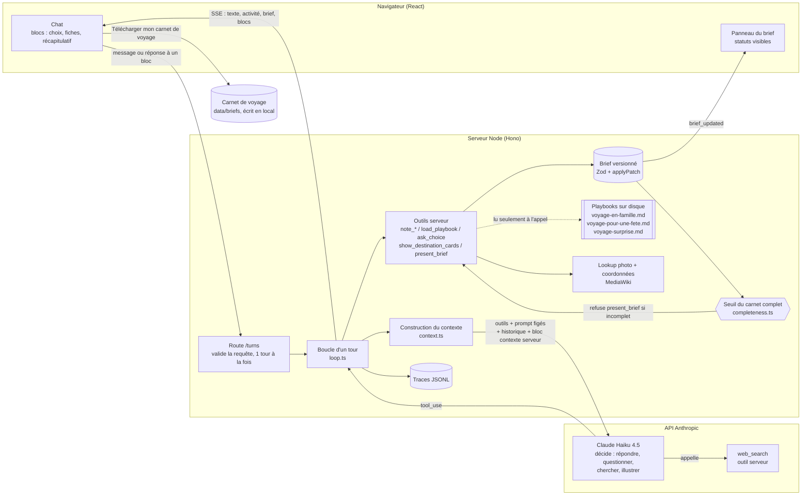

# Architecture

Un seul schéma, qui répond à la question : **qui décide quoi, à chaque tour ?**
Le détail de chaque décision (options, choix, coût) est dans [`choix-techniques.md`](choix-techniques.md).
Les mots techniques sont expliqués dans le [glossaire](glossaire.md).

## Le schéma système

## Qui décide quoi

| Décision | Qui | Pourquoi là |
|---|---|---|
| Répondre, questionner, chercher ou illustrer | **Le modèle** | C'est la capacité demandée ; un ordre codé serait un formulaire déguisé |
| Charger les instructions famille | **Le modèle**, via `load_playbook` | Contrainte du cadrage produit ; le serveur ne fait que rappeler si le brief contient des enfants |
| Ce qu'une information veut dire (valeur, statut, citation) | **Le modèle**, via les outils `note_*` | Il lit le langage naturel ; le serveur valide la forme |
| Si une information est valide | **Le serveur** (Zod, garde-fou de syntaxe, JSON illisible) | Une entrée d'outil est une sortie de modèle non fiable |
| Si un nombre de voyageurs « confirmé » a vraiment été dit | **Le serveur** (`brief/fidelity.ts`) | Le risque clé : un brief faux qui a l'air sûr (décision 17) |
| Si une durée « confirmée » a bien été dite en nuits | **Le serveur** (`brief/fidelity.ts`) | « Une dizaine de jours » devenait « 9 nuits, confirmé » (décision 19) |
| Si une période sans année est déjà passée | **Le serveur** (`note_dates`), qui la décale d'un an | Le modèle notait « juin 2026 » en septembre 2026 (décision 18) |
| Si le carnet est prêt à être présenté au voyageur | **Le serveur** (`completeness.ts`) | Décision produit : testable, stable, réglable sans prompt |
| Combien d'appels au modèle par tour | **Le serveur** (6 max, le dernier sans outils) | Coût et latence bornés ; le voyageur récupère toujours la main |
| Photo et coordonnées d'une fiche | **Le serveur** (MediaWiki) | Une adresse d'image ou des coordonnées écrites par un modèle peuvent être fausses |
| Quand l'interface attend le voyageur | **Le serveur**, sur un outil terminal | L'interface ne devine pas : elle reçoit `turn_end.awaiting` |
| Valider et télécharger le carnet | **Le voyageur**, par un bouton | Le carnet ne se télécharge que sur une action explicite |

## Le cheminement d'un message

1. Le voyageur écrit, ou clique une option. L'interface envoie `POST /api/conversations/:id/turns`.
2. La route valide le corps, refuse un second tour simultané (409) et vérifie que la réponse
   correspond à l'interaction en attente, **avant** de modifier l'état.
3. `context.ts` construit le message du tour : le texte du voyageur (ou le `tool_result` de la
   question en attente), puis un bloc `<contexte_serveur>`. Ce bloc contient la date, l'état du
   brief, ce qui manque et les playbooks chargés. Il finit par des rappels courts : trois toujours
   présents, plus un dernier qui dépend de l'état du brief. Si le carnet est déjà validé, il dit de
   répondre sans rien reproposer. Sinon, il dit de proposer la validation du carnet, de proposer
   des fiches, ou d'enregistrer d'abord puis de poser la question qui manque.
4. `loop.ts` appelle le modèle en streaming. Le texte part au fil de l'eau vers l'interface.
   Une recherche web s'exécute chez Anthropic dans le même appel.
5. Si le modèle appelle des outils, le serveur les exécute dans l'ordre. `note_*` vérifie
   l'entrée, applique les contrôles en code (voyageurs non dits, année passée, hésitation entre
   lieux), met à jour le brief, puis renvoie son état et la question suivante à poser.
   `load_playbook` renvoie le texte des instructions. Une entrée au JSON illisible reçoit une
   erreur d'outil : le modèle la réécrit, le tour continue.
6. Un outil terminal (`ask_choice`, `present_brief`) affiche un bloc et **arrête le tour**. La
   réponse du voyageur deviendra le résultat de cet outil au tour suivant.
7. Sinon, les résultats repartent au modèle, au plus 6 appels. Le dernier est forcé en texte.
8. `turn_end` dit à l'interface ce qu'elle attend : texte, choix, confirmation ou fin.

## Ce que le modèle voit

Ordre du préfixe, celui du cache de prompt :

1. **Les outils** : 9 outils serveur + `web_search`. Figés.
2. **Le prompt système** : mission, règles de décision, ton, sécurité.
   Figé, sans aucune instruction famille (test `context.test.ts`).
3. **L'historique** : ajouté, jamais réécrit. Le texte d'un playbook y entre au tour où il
   est chargé.
4. **Le bloc `<contexte_serveur>`** du tour : la seule partie qui varie.

## Technologies et raison d'être de chaque pièce

| Pièce | Rôle | Pourquoi elle |
|---|---|---|
| `@anthropic-ai/sdk`, boucle maison | Appels au modèle, outils | Contrôle exact de la requête : la contrainte famille devient testable |
| Hono + `@hono/node-server` | Serveur web et SSE | `app.request()` teste les routes sans serveur ; SSE natif |
| Zod | Validation, schémas d'outils | Une seule définition produit la validation et le JSON Schema |
| React + Vite | Interface | Composants dédiés aux blocs d'outils ; pas de couche d'abstraction de chat |
| Vitest, Biome | Tests, lint et format | Un outil chacun, sans plugin |
| Fichiers JSONL et JSON dans `data/` | Traces, carnets validés | Le plus simple qui tienne pour une démonstration |

Écartés : Kubernetes, bases de données, LiteLLM Gateway, Langfuse câblé, CopilotKit, Claude
Agent SDK. Raisons dans [`choix-techniques.md`](choix-techniques.md).
