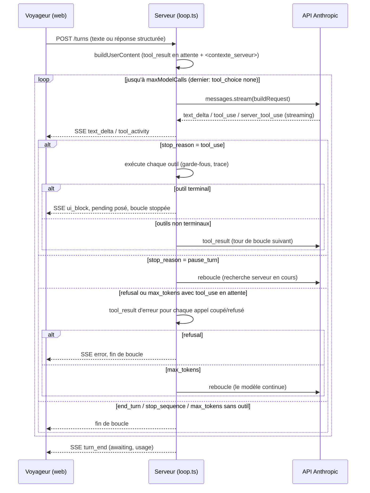

# Spécification technique : Travel Notebook Agent

## En bref

Ce document explique comment le code fonctionne, fichier par fichier et ligne par
ligne. Il ne dit pas pourquoi on a choisi telle solution : ça, c'est `docs/choix-techniques.md`.

Trois idées à retenir avant de lire le détail. Le modèle ne décide jamais seul si un projet de
voyage peut être présenté comme carnet complet : c'est notre code qui vérifie, avec des règles
testées.
Le modèle choisit des outils (chercher sur le web, noter une information, poser une question),
et c'est notre serveur qui les exécute et qui garde le contrôle. Chaque garde-fou cité ici a été
mesuré sur le vrai modèle, jamais deviné : les preuves sont dans `docs/scenarios/`.

Décrit l'état réel du code au 2026-09-25. `npm run typecheck` passe sans erreur, et les 416 tests
unitaires passent (`npx vitest run`, 36 fichiers). Les numéros de ligne peuvent glisser un peu après cette date.

Les mots techniques sont expliqués dans le [glossaire](glossaire.md).

## 1. Le modèle du brief (`src/shared/brief.ts`)

Chaque information du brief est une case (`slot()`, `brief.ts`, voir le glossaire pour ce
mot). Une case porte un statut, une valeur qui peut être vide, et des `alternatives[]` du même
type. Elle porte aussi des `evidence[]` : les phrases exactes du voyageur qui justifient la
valeur, chacune avec le tour où elle a été dite (`{quote, turn}`, `brief.ts`). Les dates
suivent le type `IsoDate`
(`brief.ts`) : elles doivent avoir la forme
AAAA-MM-JJ, et exister vraiment dans le calendrier. `2027-13-45` et `2027-02-30` sont donc
refusées avant même d'arriver à `completeness.ts`. Ce fichier garde quand même un filet de
sécurité (ligne 65), au cas où une date resterait illisible malgré tout.

| Champ | Obligatoire | Forme de `value` | Exemple |
|---|---|---|---|
| `destination` | oui | `{ mode: open\|shortlist\|fixed, places[], zone\|null, criteria[] }` | `{mode:"open", criteria:["soleil"]}` |
| `dates` | oui | `{ earliest, latest }` ISO + `label` | `{earliest:"2027-02-01", latest:"2027-02-28", label:"vacances de février"}` |
| `duration` | oui | `{ minNights, maxNights }` | `{minNights:9, maxNights:10}` |
| `travellers` | oui | `{ total:{min,max}, adults\|null, children:[{age\|null}], label }` | `2 adultes et 2 enfants (4 et 7 ans)` |
| `departure` | non | `string` (ville ou aéroport de départ, 80 caractères au plus) | `Lyon` |
| `budget` | non | `{ min\|null, max, currency:"EUR", per: person\|total }` | `jusqu'à 4000 EUR par voyage` |
| `style`, `interests`, `constraints` | non | `string[]` (1 à 10) | `["slow travel"]` |

Statuts (`SLOT_STATUSES`, `brief.ts`) et traitement :

| Statut | Sens | Bloque le carnet complet ? |
|---|---|---|
| `unknown` | pas encore évoqué | oui |
| `vague` | flou ou flexible, le voyageur l'a dit comme tel | non, si l'intervalle passe les seuils |
| `inferred` | déduit par l'agent sans confirmation | oui, tant que non validé |
| `confirmed` | dit clairement ou validé | non |
| `conflicting` | deux réponses différentes, l'autre dans `alternatives` | oui |

Le brief entier a un numéro de version. Il augmente seulement si quelque chose change vraiment
(`apply-patch.ts`), et un `changelog[]` garde l'historique de ces changements. `nuances[]`
garde les phrases utiles du voyageur qui n'entrent dans aucune case, mot pour mot, sans doublon.
Il y a une limite : `MAX_NUANCES` (20, `apply-patch.ts`). Au-delà, le voyageur ne relit plus tout,
donc les premières phrases confiées sont gardées en priorité, car ce sont les plus parlantes
(`apply-patch.ts`).

**Seuil de complétude** (`src/server/agent/brief/completeness.ts`), calculé en code, jamais par
le modèle :

| Constante | Valeur | Justification (commentaire du code) |
|---|---|---|
| `MAX_DATE_WINDOW_DAYS` | 45 | "Au-delà d'un mois et demi, la saison reste inconnue, donc le climat et les prix aussi." |
| `MAX_DURATION_SPREAD_NIGHTS` | 7 | "Une semaine d'écart change l'itinéraire mais pas sa structure : le voyage s'organise déjà." |
| `MAX_TRAVELLERS_SPREAD` | 1 | "'4 ou 5' s'organise avec une variante ; '4 ou 6' change les chambres et les véhicules." |
| `SENDABLE_STATUSES` | `{confirmed, vague}` | voir la table des statuts ci-dessus |

`computeCompleteness` (`completeness.ts`) renvoie trois informations : si le carnet est complet
(`ready`), combien de cases obligatoires sont bonnes (`mandatoryOk`), et ce qui manque encore
(`missing[]`). Pour que `ready` soit vrai, il faut en plus une zone de destination choisie, jamais
`open` toute seule. Il faut aussi une durée qui tient dans la fenêtre de dates choisie, et l'âge de
chaque enfant connu (`checkField`, `completeness.ts`). Le modèle voit ce résultat dans le bloc
`<contexte_serveur>` (`context.ts`). Il ne le calcule jamais lui-même.

Ce bloc contient un résumé du carnet, une ligne par information (`summarizeBrief`,
`brief/summarize.ts`). Le modèle le relit à chaque tour et en reprend souvent les mots à l'oral,
donc il s'écrit comme une phrase lisible. Une durée dont les deux bornes sont égales donne
« 6 nuits », pas « 6 à 6 nuits » ; une fourchette garde ses deux bornes.

## 2. Les outils

Un outil (voir le glossaire) est une action que le modèle peut demander. Notre code l'exécute et
renvoie ce qui s'est passé. Ce projet en a neuf, plus la recherche web fournie par Anthropic.

| Outil | Termine le tour ? | Ce qu'il fait | Événement envoyé |
|---|---|---|---|
| `note_destination`, `note_dates`, `note_duration`, `note_travellers`, `note_preferences` | non | Enregistre une information du voyage dans le brief | `brief_updated` |
| `load_playbook` | non | Charge un jeu d'instructions spécialisées | `playbook_loaded` |
| `ask_choice` | oui | Pose une question au voyageur, avec des boutons | `ui_block` (`choice`) |
| `show_destination_cards` | non | Affiche une à trois fiches de destination | `ui_block` (`cards`) |
| `present_brief` | oui | Affiche le récapitulatif, avant la validation | `ui_block` (`brief_summary`) |
| `web_search` (outil serveur Anthropic) | non | Cherche sur le web, exécuté chez Anthropic | `tool_activity` + `sources` |

### Les cinq outils `note_*` (`tools/brief-tools.ts`)

Leurs paramètres sont plats : des nombres, du texte, des listes de texte (lignes 137-240). Pas
d'objet imbriqué. Raison mesurée le 2026-09-16 : avec des objets imbriqués, Haiku 4.5 écrivait des
entrées cassées (`"interests": "\n<parameter name=\"status\">..."`). Et le mode strict qui aurait
empêché ça était refusé par l'API sur ce schéma : « compiled grammar is too large ». Chaque outil
convertit son entrée en `BriefPatch` interne. La validation (Zod) et la fusion (`applyPatch`)
restent uniques et testées, quel que soit l'outil appelé (lignes 46-104). Un statut `conflicting`
sans `alternatives` est refusé plutôt qu'accepté avec une alternative vide (`apply-patch.ts`).
Le champ `zone` est aussi nettoyé avant d'entrer dans le brief : une case vide, « plusieurs pays »
ou « à définir » deviennent toutes `null` (`normalizeZone`, `brief-tools.ts`).

Avant que l'entrée entre dans le brief, un crochet de relecture (`review`, lignes 106-135) peut la
corriger et ajouter une note pour le modèle :

- **`note_destination`** (`brief-tools.ts`) : un statut `conflicting` dont « l'autre lieu »
  est déjà dans la liste des lieux devient `vague` à la place. Ce n'est pas une contradiction,
  c'est une hésitation. Cas réel mesuré (essai de robustesse, 2026-09-17) : « On hésite entre le
  Japon et la Corée du Sud » était noté en conflit.
- **`note_dates`** (`brief-tools.ts`) : une période entièrement passée, sans année écrite
  par le voyageur, glisse à l'année suivante, et l'année du libellé suit (« juin 2026 » devient
  « juin 2027 »). Cas réel mesuré le 2026-09-17 : « on part en juin »,
  dit en septembre 2026, était noté juin 2026, une date déjà passée. Une année écrite par le
  voyageur (`SAID_YEAR`) n'est jamais changée. Un montant (« 2027 € », « 2027 dollars ») n'est pas pris
pour une année. La comparaison des lieux ignore accents et majuscules (`samePlace`).
- **`note_travellers`** (`brief-tools.ts`) : un nombre de voyageurs `confirmed` est
  ramené à `inferred` si le voyageur ne l'a pas vraiment dit. Voir `brief/fidelity.ts` plus bas.
- **`note_preferences`** (`brief-tools.ts`) : une seule citation par appel, partagée entre le
  départ, le budget, le style, les envies et les contraintes. `citationParleDe`
  (`src/shared/citation.ts`) ne la garde que sous les valeurs dont elle parle. Elle compare un mot
  de la valeur, ses quatre premières lettres, ou un montant écrit « 4 000 » ou « 4k ». Sinon, la
  case est enregistrée sans citation (décision 40 de `docs/choix-techniques.md`). Le carnet
  (fonction `ligne`, `carnet.ts`) réutilise la même fonction pour choisir, parmi les citations
  d'une case, la plus récente qui parle de la valeur affichée. Pour la destination et la ville de
  départ, sans phrase qui nomme le lieu, la ligne s'imprime sans citation.

Chaque outil `note_*` ajoute aussi des notes à son résultat, dont un rappel si le brief contient
un enfant sans le playbook famille chargé (`brief-tools.ts`). La consigne de suite est
calculée une seule fois par appel au modèle, après tous les `note_*` de cet appel, et ajoutée au
dernier de leurs résultats (`briefGuidance`, `brief-tools.ts`, appelée depuis `loop.ts`).
C'est soit « appelle `present_brief` » si le brief est complet, soit la question suivante
(`nextQuestionHint`, voir plus bas). Audit du contexte du 2026-09-17 : calculée dans chaque
`note_*`, un résultat disait « il manque la période » et le suivant « le brief est complet ».

**`brief/fidelity.ts` : un nombre de voyageurs confirmé doit avoir été dit.** C'est le risque
clé du produit : un brief faux qui a l'air sûr. Mesuré sur de vraies conversations : « 2 adultes »
confirmé alors que le voyageur n'avait donné que l'âge des enfants. `travellersDoubt(value, said)`
relit tout ce que le voyageur a écrit ou cliqué. La valeur reste confirmée si les adultes et les
enfants notés font bien le total dit. Il faut aussi que le voyageur ait dit un nombre de personnes
(« on est 2 », « on sera quatre »), ou un mot qui désigne les adultes (« ma femme », « couple »).
Un nombre suivi
d'une unité ne compte pas : « 3 semaines » ou « 7 ans » ne sont pas un nombre de voyageurs. Si la
même valeur était déjà « à confirmer » à un tour précédent, la confirmation est acceptée : le
voyageur a eu la question sous les yeux.

Le même fichier garde la durée (décision 19). `durationDoubt(value, said)` cherche dans les mots du
voyageur deux choses collées à une unité de temps. Une formule approximative : « une dizaine de
jours », « deux semaines à peu près », « around 3 weeks ». Ou une borne : « 10 jours max », « pas
plus de deux semaines ». S'il en trouve une et qu'aucun nombre de nuits n'est dit par ailleurs, la durée est
enregistrée `vague` au lieu de `confirmed`. Les bornes, elles, ne sont
pas touchées : le code ne devine pas une fourchette à la place du modèle. `vague` ne bloque pas le
carnet complet, donc la conversation avance ; c'est l'affichage qui cesse de mentir.

**`text-guard.ts` : réparer un échappement écrit par le modèle.** `repairEscapes` décode les
séquences `\uXXXX` que le modèle écrit parfois au milieu d'un mot (« croisi\u00e8re », vu le
2026-09-17). Le filtre de streaming retient une fin de fragment qui pourrait être un échappement
coupé en deux. Un caractère de contrôle n'est jamais décodé. Décision 22.

**`traveller-text.ts` : ne relire que les mots du voyageur.** `travellerText(messages)` rassemble
tout ce que le voyageur a écrit ou cliqué dans la conversation, et rien d'autre : ni le bloc
`<contexte_serveur>`, ni les résultats d'outils, ni le texte de l'agent. Ce module définit aussi
des formats de texte partagés avec `context.ts`, comme le préfixe d'une réponse à `ask_choice`.
Cela permet de relire proprement ce que le voyageur a dit, sans dépendre du module qui écrit le
contexte. Il sert au contrôle de `fidelity.ts`, et à la correction d'année de `note_dates` : une
année écrite par le voyageur ne doit jamais être changée.

**`brief/next-question.ts` : la question suivante, calculée après coup.** `nextQuestionHint`
choisit la prochaine question à poser, une fois le message du voyageur déjà enregistré. Pourquoi
pas dans le rappel de début de tour : mesuré le 2026-09-17, nommer la question avant
l'enregistrement faisait poser « Qui part en voyage ? » à un voyageur qui venait d'écrire
« on est 2 ». Le cas Vietnam n'était validé qu'une fois sur trois au lieu de trois sur trois.
L'ordre de décision : destination ouverte et période connue -> choisir 2 ou 3 lieux et lancer une
recherche qui les nomme, puis `show_destination_cards`. Hésitation entre lieux -> `ask_choice`.
Voyageurs « à confirmer » -> les faire valider avec `ask_choice`. Sinon, la première case qui
manque, avec la raison donnée par `completeness.ts`.

### `ask_choice`

Deux à six options, pas de statut `strict` (`ask-choice.ts`). Il pose la question, puis
arrête le tour (`kind: "terminal"`). Un appel est refusé si le brief vient tout juste de devenir
complet pendant ce tour : `present_brief` passe avant une nouvelle question (`loop.ts`).

### `show_destination_cards`

Une à trois fiches, avec photo et coordonnées **toujours** trouvées côté serveur, jamais écrites
par le modèle. Refusée si aucune recherche web de la conversation ne cite le lieu ou son pays
(`ungroundedCards`, `show-destination-cards.ts`, appelé ligne 176). La comparaison se fait
mot par mot : un mot de 4 lettres ou plus, en dehors des mots trop génériques comme « îles » ou
« grande » (lignes 88-113). Le refus dit au modèle quelle recherche lancer.

L'affichage est **partiel**, pas tout ou rien (lignes 176-186). Si deux fiches sur trois sont
appuyées par une recherche, ces deux-là s'affichent quand même : seule la troisième est refusée,
avec la requête à lancer pour la montrer aussi.

`repairCardsInput` (`show-destination-cards.ts`) répare une entrée cassée avant même de la
vérifier. Cas réel du 2026-09-17 (scénario famille) : Haiku a écrit la liste des fiches en texte
JSON, avec des balises de citation recopiées d'une recherche web (`<cite ...>`). Sans réparation,
Zod refusait, l'agent réessayait à l'identique, puis écrivait les fiches en texte libre au
voyageur.

### `present_brief`

Refusé deux fois par le serveur, jamais par un choix du modèle (`present-brief.ts`). Il refuse si
`!completeness.ready` : un carnet incomplet ne peut pas être présenté, quoi qu'écrive le modèle. Il
refuse aussi si `conversation.sentAt` est déjà posé : un carnet déjà validé et téléchargé ne se
représente pas.

### `web_search` (outil serveur Anthropic)

Version `web_search_20250305` si le modèle commence par `claude-haiku`, sinon
`web_search_20260209` (`tools/index.ts`). `max_uses` vaut `config.webSearchMaxUses`
(2, `config.ts`).

### Garde-fous transverses (`loop.ts`)

Un outil inconnu renvoie une erreur. `findLeakedSyntax` (`loop.ts`) détecte une syntaxe
d'appel d'outil écrite dans une valeur texte, un défaut réellement observé même en mode strict
(`tools/types.ts`, testé sur un cas réel, `types.test.ts`). Le même contrôle refuse
aussi un accent écrit en syntaxe TeX au lieu du caractère, vu le 2026-09-17 (`Cor"{e du Sud` pour
« Corée du Sud », qui serait resté tel quel dans le carnet, `types.test.ts`). Un seul outil qui
attend le voyageur par tour : tout appel supplémentaire qui n'est pas un `note_*`, après un tel
outil, est ignoré avec un message d'erreur (`loop.ts`).

**Une entrée d'outil au JSON illisible ne casse plus le tour entier**, correctif du 2026-09-17.
Avant : le SDK ne décode l'entrée qu'à la première lecture, et une erreur de décodage arrêtait
tout le tour (incident réel, un guillemet non échappé dans un texte du voyageur). Maintenant, si
le flux échoue sur cette erreur, le message reçu jusque-là est repris depuis
`stream.currentMessage`. Le SDK enveloppe l'erreur dans une `AnthropicError` : le code regarde donc
aussi `error.cause` (`loop.ts`, prouvé par `loop.sdk.test.ts`, qui passe par le vrai SDK avec un
faux réseau). Un bloc d'outil qui ne se décode toujours pas garde
une entrée vide dans l'historique (`loop.ts`) et reçoit une erreur d'outil dédiée
(`unreadableInput()`, `tools/types.ts`). Le modèle peut alors réécrire son appel, au lieu de
perdre tout le tour.

Le texte VISIBLE par le voyageur est filtré en streaming par `createVisibleTextFilter`
(`text-guard.ts`), qui coupe tout dès qu'une balise d'appel d'outil apparaît (`<function_calls`,
`<invoke`, `<parameter`, `<antml`...). C'est un garde-fou distinct de `findLeakedSyntax`, qui ne
voit que l'entrée d'un outil, jamais le texte libre du message (`loop.ts`). Si une coupure
a lieu, le texte déjà stocké dans l'historique est nettoyé par `stripForbiddenText`, pour que le
modèle ne réapprenne pas la forme fautive, et la fuite est tracée en `text_leak`
(`loop.ts`). Le prompt système porte la même règle côté modèle (« N'écris jamais de
balises XML ni de syntaxe d'appel d'outil dans ta réponse : appelle l'outil. »,
`system-prompt.ts`). C'est une instruction, doublée par ce garde-fou en code, qui ne dépend
pas de son respect.

**Seul le premier appel du tour affiche son texte en direct**, correctif du 2026-09-17. Avant :
chaque appel au modèle, même intermédiaire, affichait sa phrase d'annonce (« Voici trois
destinations », « Laissez-moi vous montrer... »). Elles s'empilaient avant la vraie réponse. Vu
à l'écran sur le scénario famille. Maintenant, le texte du premier appel s'affiche tout de suite :
il rassure le voyageur pendant l'attente (`live`, `loop.ts`). Le texte des appels suivants est
gardé de côté (`held`) jusqu'à la fin de l'appel. Il n'est pas affiché si l'appel annonce des
fiches (`show_destination_cards`) sans outil qui attend le voyageur (`announcesCards`,
`WAITS_FOR_TRAVELLER`). Dans tous les autres cas, il s'affiche : une réponse suivie d'une simple
note reste visible.

Un appel d'outil coupé par `max_tokens`, ou interrompu par un `refusal` (le message contient des
`tool_use` sans `stop_reason: "tool_use"`), reçoit un `tool_result` d'erreur généré par le serveur
pour chacun (`loop.ts`). Sans lui, l'API renverrait 400 au tour suivant, faute de résultat
pour un appel resté sans réponse. Ce comportement est prouvé sur un client scripté
(`loop.test.ts`), pas sur le comportement réel du modèle.

Un bloc de texte vide ne rentre pas non plus dans l'historique. Le modèle ouvre parfois un bloc
sans rien écrire avant d'appeler un outil. Renvoyé tel quel, il vaut un 400 : « text content
blocks must be non-empty », vu une fois sur 45 conversations de campagne. Le serveur le retire à
l'écriture et garde le reste du message (`loop.ts`, prouvé par `loop.test.ts`).

Une variable d'environnement vide vaut une variable absente. `.env.example` livre `API_PORT=`
prêt à remplir : lu par `Number("")`, il valait zéro, donc un port tiré au hasard par le système.
L'interface cherchait alors l'API sur 8787 et ne la trouvait plus. Le port se lit par `apiPort()`
(`config.ts`), utilisé aussi par `vite.config.ts` pour que les deux côtés visent le même port.

### Mesure du ton visible (`reply-metrics.ts`)

Ce module ne tourne jamais pendant une vraie conversation. Il sert seulement à mesurer,
après coup, les réponses produites par de vrais appels au modèle (`scripts/scenarios.ts`).
`replyMetrics(text)` compte, dans une réponse : les superlatifs (« parfait », « incroyable »...),
la narration des coulisses (« je vais enregistrer », « je corrige »...), le mot « brief », le
tutoiement, et le nombre de mots. Chaque motif vient d'un défaut relevé sur de vraies
transcriptions, pas d'une supposition (audit du 2026-09-17 : superlatif dans 6 transcriptions sur
7, narration des coulisses dans 2 sur 7). Un compteur à zéro ne prouve pas que le ton est bon. Il
prouve seulement que ces défauts précis sont absents des passages mesurés.

## 3. La boucle d'un tour (`loop.ts`)

1. Construire le message du voyageur : réponse à l'interaction en attente en `tool_result`, plus
   les résultats des autres outils du même appel s'il y en a, sinon le texte libre du voyageur.
   Toujours suivi du bloc `<contexte_serveur>` (`buildUserContent`, `context.ts`).
2. Pour chaque appel au modèle, de 1 à `maxModelCalls` (6, `config.ts`) : construire la requête
   (`buildRequest`), système et outils figés, plus tout l'historique, en flux (streaming).
3. Au dernier appel, forcer `tool_choice: "none"` : le modèle rend forcément la main en texte
   (`loop.ts`, `context.ts`).
4. Émettre `text_delta` pour chaque fragment de texte visible, et `tool_activity` pour chaque
   outil ou recherche web vus dans le flux (`loop.ts`). Seul le premier appel du tour
   affiche son texte en direct (voir section 2) : les suivants attendent, pour ne pas empiler des
   phrases d'annonce avant la vraie réponse.
5. Si le flux échoue sur un JSON d'entrée d'outil illisible, reprendre le message partiel plutôt
   que de perdre le tour entier (voir section 2, garde-fous transverses).
6. Si l'API met le tour en pause pour finir une recherche serveur (`pause_turn`), reboucler sans
   consommer un tour de conversation supplémentaire (`loop.ts`).
7. Si un appel d'outil a été coupé (`max_tokens`) ou refusé (`refusal`), ajouter d'abord un
   `tool_result` d'erreur pour chacun (`loop.ts`). Sur un `refusal`, arrêter avec une
   erreur visible (`loop.ts`). Sur un `max_tokens` avec un outil en attente, reboucler
   pour laisser le modèle continuer (`loop.ts`). Sinon (`end_turn`, `stop_sequence`, ou
   `max_tokens` sans outil), arrêter : le voyageur récupère la main (`loop.ts`).
8. Sinon, exécuter chaque outil demandé, dans l'ordre reçu, avec les garde-fous de la section 2.
   Tracer chaque appel (`trace()`, JSONL). Un outil qui attend le voyageur fixe
   `conversation.pending` et arrête la boucle (`loop.ts`). Les autres deviennent des
   `tool_result` renvoyés au modèle au tour de boucle suivant (`loop.ts`).
9. En cas d'exception (échec de l'API par exemple), annuler et revenir à l'état d'avant le tour :
   messages, brief, interaction en attente, playbooks, tour (`loop.ts`). Le voyageur voit
   alors un message d'erreur générique, sans rien perdre de son projet.
10. Toujours terminer par `turn_end`, avec l'état d'attente final et l'usage du tour (appels,
    tokens, cache, recherches, durée) (`loop.ts`).

**Le brief qui devient complet passe avant une question.** `readyAtStart` fige, tout au début du
tour, si le brief était déjà complet avant que le voyageur écrive (`loop.ts`). S'il ne l'était
pas et le devient en cours de tour, deux garde-fous s'activent. Un appel à `ask_choice` est refusé
(`loop.ts`). Et si le modèle termine son tour sans avoir appelé `present_brief`, le
serveur insère un message et force cet appel à l'itération suivante (`loop.ts`). Un brief
déjà prêt AVANT le tour n'est concerné par aucun des deux : le voyageur a pu vouloir y revenir
sans qu'on le pousse vers la validation.

Cas particulier non montré sur ce schéma : un appel d'outil dont l'entrée JSON est illisible.
Le message partiel est repris, l'appel cassé reçoit une erreur d'outil dédiée, et le tour continue
au lieu d'échouer en entier (section 2).

## 4. Construction du contexte (`context.ts`)

Ordre du préfixe, celui mis en cache : la liste d'outils (figée, dans un ordre fixe,
`tools/index.ts`), le prompt système (figé, `system-prompt.ts`), puis tout l'historique des
messages. Rien avant le message du tour ne varie d'une conversation ou d'une date à l'autre, ce
qui est prouvé par un test (`context.test.ts`). Ce qui varie (la date du jour, le tour,
l'état du brief, les playbooks chargés) n'entre que dans le dernier bloc du message du voyageur,
via `<contexte_serveur>` (`serverContextBlock`, `context.ts`).

**Trois rappels permanents** s'ajoutent à chaque tour (`turnReminders`, `context.ts`). Le
premier porte deux règles à la fois : chercher sur le web avant d'affirmer un fait sensible, et ne
jamais annoncer les outils appelés. Le deuxième porte le ton : vouvoiement, 80 mots au plus, pas
de superlatif ni d'interjection. Une phrase courte peut précéder un appel d'outil, mais jamais
pour raconter ce qu'on enregistre. Jamais non plus le mot « brief ». Ce rappel a été ajouté après
un audit du 2026-09-17 : un superlatif dans 6 transcriptions sur 7, le mot « brief » dit au
voyageur dans 1 sur 7. Le troisième dit de chercher puis montrer une fiche si le voyageur demande
où est un lieu.

**Deux rappels de plus s'ajoutent chacun à part, selon l'état de la conversation.** Si une
information obligatoire est déjà suffisante mais que le brief n'est pas complet, un rappel la
nomme et dit de ne plus la redemander, même pour l'affiner (`dejaSuffisant`, `context.ts`,
décision 33 de `docs/choix-techniques.md`). Mesuré sur une vraie conversation : la période
redemandée quatre fois, la durée deux fois, alors que le voyageur avait déjà répondu « je suis
flexible ». Si le modèle a posé deux questions à choix ou plus d'affilée
(`consecutiveChoices`, `conversation.ts`), un autre rappel lui dit d'avancer autrement ce tour.

**Un dernier rappel s'ajoute selon l'état du brief, jamais deux de ce groupe à la fois.** Si le
carnet est déjà validé (`conversation.sentAt`), aucun rappel n'est ajouté : le modèle répond
simplement, sans reproposer le récapitulatif. Correctif à un défaut observé : sans cette coupure,
un second récapitulatif s'affichait après le téléchargement. Sinon, si le brief est complet, il dit
d'appeler `present_brief` maintenant. Si la destination reste ouverte et que la période est connue,
il dit de chercher puis de proposer 2 ou 3 fiches. Sinon, il reste volontairement générique :
enregistrer d'abord ce que dit le message, puis poser la question qui manque avec `ask_choice`,
jamais une information que le voyageur vient de donner. La question
PRÉCISE à poser n'est plus calculée ici. Elle vient du résultat des outils `note_*`
(`brief/next-question.ts`, voir la section 2), une fois le message déjà enregistré. Raison mesurée
le 2026-09-17 (décision 9 de `docs/choix-techniques.md`) : nommer la question avant
l'enregistrement faisait demander « Qui part en voyage ? » à un voyageur qui venait d'écrire
« on est 2 ». Le brief Vietnam n'était alors validé qu'une fois sur trois, contre trois sur trois
après le correctif.

Le module `traveller-text.ts` (voir section 2) définit les formats partagés entre ce fichier, qui
écrit le message du tour, et la relecture de ce que le voyageur a dit. `context.ts` importe trois
constantes qui viennent de ce module : le préfixe de réponse à une question à choix, le préfixe
d'un message libre, et l'ouverture du bloc `<contexte_serveur>`. Les deux modules restent ainsi
d'accord sur la forme exacte du texte, sans dépendance dans l'autre sens.

Le texte du voyageur ne peut pas ouvrir ou fermer un faux bloc `<contexte_serveur>`.
`neutralizeServerTags` (`context.ts`) remplace le chevron d'un tel bloc, écrit par le
voyageur, par un caractère visuellement proche. Ce contrôle s'applique à chaque endroit où du
texte libre entre dans le message (`context.ts`, `neutralizeServerTags`). Sans lui, le voyageur
pourrait écrire un faux état du brief juste avant le vrai bloc généré par le serveur. Deux cas le
testent : un message libre, et une réponse libre à une question à choix (`context.test.ts`).

`cache_control: { type: "ephemeral" }` est posé sur la requête (`context.ts`). Haiku 4.5 ne met
en cache qu'au-delà de 4 096 tokens de préfixe : inactif au premier appel d'une conversation, utile
dès que l'historique grossit. Une préchauffe au démarrage du serveur (`warm-up.ts`) évite un coût
au premier voyageur après une mise à jour du serveur. Sans elle, ce voyageur attendrait la
préparation de la grammaire des outils stricts : mesurée à 67,5 secondes la première fois, contre
6 secondes ensuite (`warm-up.ts`).

## 5. Chargement à la demande des playbooks

Trois playbooks livrés : `voyage-en-famille`, `voyage-pour-une-fete` et `voyage-surprise`. Chacun a
sa raison de chargement et un libellé destiné à l'affichage, par exemple « Conseils voyage en
famille » (`playbooks/index.ts`). Ce libellé est aussi porté par l'événement SSE `playbook_loaded`.
Cette description devient l'index dans la description de l'outil `load_playbook`
(`load-playbook.ts`, `loadPlaybookTool`) : c'est le seul endroit du contexte permanent qui
mentionne son existence. Le contenu du fichier `.md` n'est lu qu'à l'appel de l'outil.

Cette description dit aussi comment l'appeler : « Appelle-le sans l'annoncer au voyageur : un
bandeau le lui montre déjà » (`load-playbook.ts`). Le modèle ne doit donc jamais dire au voyageur
qu'il charge des instructions : l'événement `playbook_loaded` l'affiche déjà, sous forme de bandeau
(`PlaybookNotice.tsx`).

- **On peut le rappeler sans risque.** Un deuxième appel avec le même nom renvoie « déjà chargé
  depuis le tour N », sans recopier le texte une seconde fois (`load-playbook.ts`).
- **L'origine n'est comptée que si le modèle a vu le rappel.** `nudgeSeenByModel`
  (`load-playbook.ts`) compare la longueur de l'historique à celle du moment où le rappel a
  été émis. `origin` ne vaut `nudged` que si l'historique a grossi depuis. Un chargement dans le
  même appel que l'outil `note_*` qui déclenche le rappel reste `spontaneous`
  (`load-playbook.ts`).
- **Chaque chargement est tracé.** Le tour, la raison donnée par le modèle, et l'origine qui vient
  d'être déterminée, sont écrits en JSONL (`load-playbook.ts`, `conversation.ts`).
- **Un filet de rappel.** Chaque outil `note_*` ajoute une ligne de rappel dans son propre
  résultat dans deux cas. Un enfant dans le brief sans le playbook famille chargé, ou une fête
  nommée par le voyageur sans le playbook fête chargé. Il note aussi, dans `nudgedPlaybooks`,
  qu'un rappel a été émis pour ce playbook, une seule fois : le premier rappel n'est pas écrasé
  par les suivants (`brief-tools.ts`).
- **Test de non-fuite** (`context.test.ts`) : des marqueurs extraits du fichier `.md` (des lignes
  d'au moins 25 caractères). Un contrôle négatif vérifie qu'aucun marqueur n'apparaît dans la
  requête du tour 1, ni dans le prompt système, même si le voyageur parle d'enfants (lignes
  55-68). Un contrôle positif vérifie que tous les marqueurs sont présents dans la requête après
  un appel réel de `load_playbook.run` (lignes 70-97). L'absence de recopie au deuxième appel est
  vérifiée séparément (lignes 99-109), tout comme la distinction `spontaneous` / `nudged` (lignes
  155-194). Ce fichier ne contient pas de sabotage explicite plus large : retirer le garde-fou,
  et vérifier que le test tombe. Les contrôles existants suffisent à distinguer présence, absence
  et origine. Mais rien ne prouve qu'un contournement du code ferait échouer précisément ce test.

## 6. Contrat des routes et du flux d'événements (`app.ts`)

Un contrôle nommé `bodyLimit` est déclaré AVANT toute route, sur tout `/api/*`
(`app.ts`). Un corps de requête au-delà de `MAX_BODY_BYTES` (16 Ko, `app.ts`, une large
marge sur un message de 2 000 caractères au plus) reçoit un code 413. Cet ordre compte : un
contrôle Hono ne s'applique qu'aux routes déclarées après lui. Avant un correctif du 2026-09-17,
`POST /api/conversations` était déclarée avant ce contrôle, et acceptait donc un corps de 40 Ko
sans le refuser.

| Route | Codes | Rôle |
|---|---|---|
| `POST /api/conversations` | 201, 413 | Crée une conversation, rend le brief vide, `completeness` et `expiresAt` |
| `GET /api/conversations/:id` | 200, 404 | Dit si le serveur a encore la conversation, jusqu'à quand, combien de tours restent, et si elle est déjà validée. Lecture passive : elle ne repousse pas l'échéance |
| `POST /api/conversations/:id/turns` | 404, 400, 409, 413, 429 | Lance un tour, réponse en flux SSE. 400 aussi si une réponse à choix n'est pas une des options proposées |
| `POST /api/conversations/:id/send` | 400, 404, 409, 413, 500 | Valide le carnet et l'écrit en local, prêt à être téléchargé. Corps facultatif `{ contact }`. 400 si le contact est mal formé, 409 si le carnet n'est pas complet ou si un tour est en cours |

Sur `/turns` : 404 si la conversation est inconnue. 400 si la requête est invalide, ou si elle ne
correspond pas à l'interaction en attente (mauvais identifiant d'outil, mauvais type). Cette
vérification (`buildUserContent`, une fonction pure) se fait AVANT tout changement d'état
(`app.ts`) : une requête incohérente ne marque donc rien comme validé ni comme occupé. 409
si le carnet est déjà validé, ou si le voyageur demande la validation sur un carnet qui n'est pas
encore complet. 409 aussi si un tour est déjà en cours sur cette conversation : deux requêtes
envoyées en même temps ne peuvent pas démarrer deux tours en parallèle (`app.ts`). 429 si
`conversation.turn` a atteint
`MAX_TURNS_PER_CONVERSATION` (40, `conversation.ts`, `app.ts`) : une fois cette limite
passée, `/turns` refuse tout nouveau tour, mais le carnet déjà construit reste consultable et peut
être validé via `/send`.

Particularité observée : `/turns` écrit déjà le carnet validé dès la décision de validation, mais
seulement après une écriture réussie (`persist` est injectable pour les tests, `app.ts`). Un échec
d'écriture y remonte comme un simple événement SSE `error` (`app.ts`), sans code d'erreur puisque le
flux est déjà ouvert. `/send`, lui, le renvoie en 500 lisible (`app.ts`). L'interface appelle
`/send` en plus après une validation réussie sur `/turns` (`sendBrief` côté web) : cela n'écrit rien
une deuxième fois, car une deuxième validation renvoie simplement la date de la première.

Événements SSE (`src/shared/events.ts`) : `text_delta`, `tool_activity`, `sources`,
`brief_updated`, `playbook_loaded`, `ui_block` (`choice` / `cards` / `brief_summary`), `turn_end`,
`error`.

## 7. Persistance et traces

L'état de chaque conversation vit en mémoire, dans une `Map` (`ConversationStore`,
`conversation.ts`). Il est perdu si le serveur redémarre : un choix assumé pour la démonstration
(commentaire `conversation.ts`). Le navigateur garde de son côté le fil visible, pour qu'une
actualisation ne reparte pas de zéro (`web/lib/persistance.ts`, décision 29). Il ne garde jamais
l'historique envoyé au modèle : seul le serveur l'a, et `GET /api/conversations/:id` dit s'il
l'a encore et jusqu'à quand, sans repousser l'échéance. Une conversation sans tour en cours, inactive depuis plus de
`CONVERSATION_TTL_MS` (6 heures, `conversation.ts`), est oubliée. Elle est balayée à chaque
création de conversation (`evictExpired`, `conversation.ts`), et vérifiée à chaque lecture
(`isExpired`, `get`, `conversation.ts`), sans minuterie séparée.

Le fil affiché est gardé par le navigateur, dans `localStorage`, sous une clé qui porte son
numéro de version (`web/lib/persistance.ts`). Cinq conversations au plus. Une donnée illisible ou
d'une version précédente est effacée plutôt que devinée, et l'application démarre sur une
conversation neuve. Chaque lecture et chaque écriture est protégée : un navigateur qui refuse le
stockage ne doit jamais empêcher le chat de fonctionner.

L'événement `turn_end` porte `expiresAt` et `turnsRemaining` (`shared/events.ts`). Le navigateur
ne recalcule jamais l'échéance lui-même, puisque le délai repart à chaque message.

`data/traces/<id>.jsonl` (hors dépôt) : une ligne par appel d'outil, chargement de playbook,
rappel de filet, usage d'un tour, et erreur (`TraceRecord`, `conversation.ts`). Les
appelants ne font jamais `await trace(...)`, car une trace ne doit pas ralentir un tour. Sans
précaution, deux écritures en même temps sur le même fichier pourraient s'inverser. `trace()`
fait donc transiter chaque écriture par une file d'attente par conversation
(`conversation.ts`), qui chaîne les écritures dans l'ordre des appels, jamais dans l'ordre où
les promesses se résolvent (`conversation.ts`). Un vrai test lance 30 écritures sans les
attendre, puis relit le fichier pour vérifier l'ordre (`conversation.test.ts`).

`data/briefs/<id>.json` (hors dépôt) : le brief tel qu'il était au moment de la validation, avec
sa date. Le fichier porte aussi le contact donné pour valider le carnet, prénom et adresse. Ce
contact est rangé à côté du brief, jamais dedans (`persistSentBrief`, `conversation.ts`, décision
37). Cette fonction est injectable dans `createApp` (`deps.persist`), pour tester un échec
d'écriture sans toucher au vrai disque.

## 8. Écarts au plan (`docs/plan-initial.md`)

1. Modèle du serveur : `claude-haiku-4-5` par défaut (`config.ts`), surchargeable par
   `ANTHROPIC_MODEL`, et non Sonnet 5 recommandé au plan. Choix de l'auteur, pour le coût.
2. `update_brief` à objets imbriqués remplacé par 5 outils plats `note_*`. Mesuré le 2026-09-16 :
   des entrées cassées sur les objets imbriqués laissaient le brief vide (`brief-tools.ts`,
   `schema.ts`). Le mode strict qui aurait dû l'empêcher a ensuite été refusé par l'API sur
   ce schéma : 17 paramètres à type multiple, pour une limite de 16 (`apply-patch.ts`).
   La conversion en `BriefPatch` interne, elle, n'a pas changé.
3. Garde-fou `findLeakedSyntax` ajouté, absent du plan initial : il refuse une entrée d'outil dont
   une chaîne contient de la syntaxe d'appel d'outil, un défaut vu même en mode strict. Deux
   ajouts du 2026-09-17 s'appuient sur le même garde-fou : un accent écrit en syntaxe TeX au lieu
   du caractère, et une entrée illisible qui ne casse plus le tour entier (`unreadableInput`).
4. Recherche web : l'outil serveur `web_search_20250305` pour Haiku 4.5. Le plan visait
   `web_search_20260209`, incompatible avec ce modèle, vérifié par un vrai appel.
5. Photos et coordonnées des fiches : résolues côté serveur par l'API MediaWiki (français puis
   anglais), jamais écrites par le modèle. Conforme au plan, confirmé dans `destination-lookup.ts`.
6. Garde-fou `createVisibleTextFilter` / `stripForbiddenText` ajouté, absent du plan initial : il
   coupe en flux le texte VISIBLE dès une balise d'appel d'outil. Il complète le point 3, qui ne
   couvre que les entrées d'outils, jamais le texte libre produit par le modèle.

**Écarts supplémentaires constatés à la lecture, non prévus au départ :**

- Les noms des événements SSE diffèrent de ceux du plan (`text`, `tool_started`, évoqués au
  paragraphe 2 du plan). Le code utilise `text_delta` et `tool_activity` (`events.ts`), et
  ajoute `sources` et `playbook_loaded`, que le plan ne détaillait pas.
- Seuls les outils `note_*` sont déclarés `strict: true`. `ask_choice`, `show_destination_cards`
  et `present_brief` ne le sont pas (`ask-choice.ts`, `show-destination-cards.ts`,
  `present-brief.ts`). La protection stricte du plan ne couvre donc pas les outils qui
  affichent quelque chose au voyageur.
- Le bandeau produit cité par le plan, « Conseils famille activés », s'affiche en réalité comme
  « Conseils voyage en famille activés ». C'est un libellé déjà rendu plus clair
  (`playbooks/index.ts`), rendu par `PlaybookNotice.tsx`.
- `TurnUsage` porte un champ `firstTextMs`, le délai jusqu'au premier mot affiché, absent du plan.
